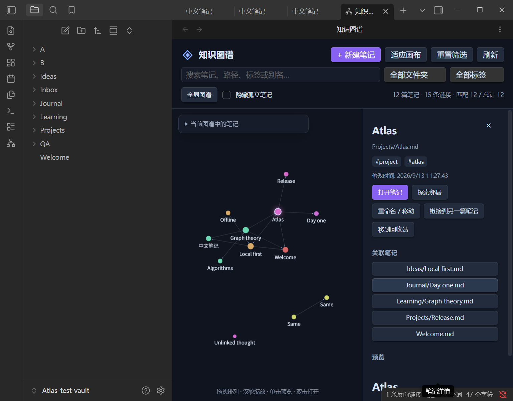

# Xingyu Note Atlas · 星宇笔记图谱

在 Obsidian 中直接探索和管理笔记的原生插件。深色力导向图、可拖拽节点、搜索筛选、笔记预览，以及实时更新的链接关系。无需单独的网页服务，也不需要导出知识库。

[English](README.en.md) · [贡献指南](CONTRIBUTING.md) · [发布指南](docs/RELEASING.md)



[当前版本的验证记录](docs/VERIFICATION.md)

## 功能

- 全局图谱：Markdown 笔记为节点，Obsidian 已解析的内部链接为有向边，按顶层文件夹着色。
- 交互：缩放、平移、拖动固定节点；右键可释放位置；连线粒子动画，可关闭。
- 搜索与筛选：文件名、路径、别名、标签；文件夹、标签、孤立笔记筛选。
- 局部图谱：探索一篇笔记的入链和出链邻居，支持 1–3 层关系。
- 原生管理：新建笔记、创建目标文件夹、重命名/移动、追加内部链接、移到回收站。
- 原生预览：MarkdownRenderer 渲染当前内容，点击打开到 Obsidian 新标签页。
- 实时更新：监听文件创建、修改、删除、移动和链接索引更新，无需重新构建网页。
- 中文/英文界面，深色或跟随 Obsidian 主题；支持系统减少动态效果偏好。
- 默认最多绘制 1500 个节点，可调整到 10000；筛选和搜索始终使用全量笔记，超限有提示。

## 本地安装

要求 Obsidian **1.8.7+**。安装插件不需要 Node.js。

1. 从 [GitHub Release](https://github.com/Eventhorizon-XingYu/obsidian-knowledge-atlas/releases/latest) 获取 `main.js`、`manifest.json`、`styles.css`，或使用本地构建生成的 `dist/xingyu-note-atlas/`。
2. 把它们放到你的知识库配置目录：`<vault>/.obsidian/plugins/xingyu-note-atlas/`。如果使用自定义配置目录，将 `.obsidian` 替换为实际目录。
3. 在 Obsidian「设置 → 第三方插件」中启用 **Xingyu Note Atlas**。如果列表没有更新，重新加载 Obsidian。
4. 点击左侧网络图标，或在命令面板运行 **Xingyu Note Atlas: 打开知识图谱**。

本项目已提交到 [Obsidian 社区插件市场](https://community.obsidian.md/plugins/xingyu-note-atlas)，当前条目正在进行自动审核。审核期间仍可通过 GitHub Release 手动安装。

本项目的插件 ID 是 `xingyu-note-atlas`，与其他作者的 Knowledge Atlas 插件不同。旧的本地开发版本曾使用 `knowledge-atlas`，不要用本项目的文件覆盖同名第三方插件。

## 使用

单击节点预览，双击节点打开原文。也可展开左上角笔记列表，用键盘选择笔记。搜索框输入多个词时，所有词都需要匹配；输入后按 Enter 选择第一个结果。

详情面板提供「新建/重命名/移动/链接/回收站」相关入口，新建在顶栏。重命名和移动输入**相对知识库的完整目标路径**，例如 `项目/新想法.md`。提交前检查弹窗展示的原路径和目标路径；插件不覆盖已有文件。链接操作先选择目标，再确认在来源笔记末尾追加链接。回收站操作有单独确认弹窗，遵循 Obsidian 配置的回收站位置。

重命名/移动使用 `FileManager.renameFile`，是否更新其他笔记中的链接，遵循 Obsidian 的「自动更新内部链接」设置。更改前可在「设置 → 文件与链接」中检查。拖动后的节点位置仅在当前视图生命周期内保留，不会写进笔记。

在插件设置中可排除特定文件夹；每行填写一个相对路径。图谱只表示当前存在的 Markdown 笔记和已解析链接，不把附件或未创建的链接目标当成文档节点。初次打开大型库时，链接可能要等 Obsidian 完成索引才出现。

## 数据与隐私

插件本身不上传笔记、不使用遥测、不调用远程 API、不启动服务器。数据来源是当前 vault 和 Obsidian 的元数据缓存。依赖随 `main.js` 一起打包。预览使用 Obsidian 原生渲染器：如果笔记包含远程图片、嵌入或其他插件渲染内容，这些内容的行为由 Obsidian 和对应插件决定。

发行包只包含插件代码、样式、清单与许可证，不包含个人知识库、路径、预生成图谱或测试配置。构建和测试产物被 Git 忽略。

## 开发

需要 Node.js 22+ 和 npm。

```sh
npm ci --ignore-scripts
npm run check
npm run package
```

`npm run dev` 监听源码变化并重新编译；把生成的 `main.js` 和根目录的清单、样式复制到专用测试库。`npm test` 运行纯数据单元测试。原生宿主集成测试见 [测试说明](docs/TESTING.md)。

```text
src/main.ts       插件生命周期、命令、vault 事件和元数据快照
src/graph.ts      无副作用的关系构建、筛选、邻域遍历、路径校验
src/view.ts       原生 ItemView、力导向图、预览与交互
src/operations.ts 原生弹窗、路径操作、原子链接追加
src/settings.ts   设置与配置校验
src/i18n.ts       中文/英文文案
scripts/          打包、许可归档和隔离测试库生成
```

GitHub Actions 对提交执行测试和构建，推送与版本号一致的标签（例如 `1.0.0`）后会创建 Release。操作细节见发布指南。

## 许可证

[MIT](LICENSE)。打包依赖的完整许可文本见 [THIRD_PARTY_NOTICES.md](THIRD_PARTY_NOTICES.md)。本项目与 Obsidian 官方无隶属关系。
